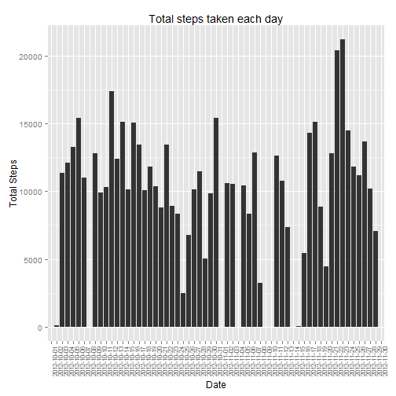
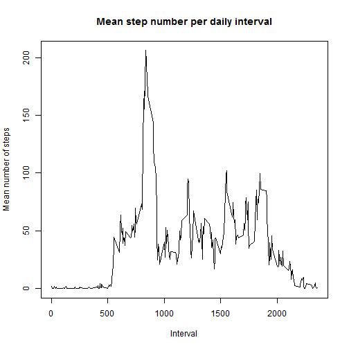
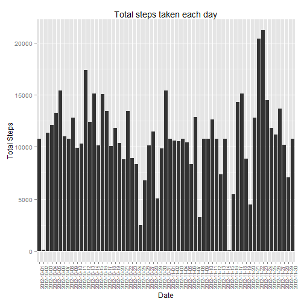
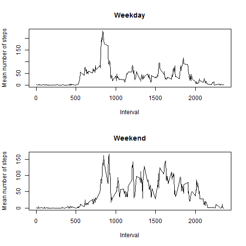

Assignment to answer questions about step data forked from https://github.com/rdpeng/RepData_PeerAssessment1 to new repo at https://github.com/ascatanach/RepData_PeerAssessment1.

For the code I tended to use chaining for ease.

Using the following libraries:


```r
library(dplyr)
```

```
## 
## Attaching package: 'dplyr'
## 
## The following object is masked from 'package:stats':
## 
##     filter
## 
## The following objects are masked from 'package:base':
## 
##     intersect, setdiff, setequal, union
```

```r
library(data.table)
```

```
## Warning: package 'data.table' was built under R version 3.1.2
```

```
## 
## Attaching package: 'data.table'
## 
## The following objects are masked from 'package:dplyr':
## 
##     between, last
```

```r
library(ggplot2)
```


## Loading and preprocessing the data
Data was cloned using git, unzipped and loaded into object called data. Used read.table instead of read.csv, end result is the same:

```r
setwd("H:/Coursera/Reproducible_Research/Assignment1/RepData_PeerAssessment1")
data <- read.table(unz("activity.zip", "activity.csv"), header=T, quote="\"", sep=",")
```

## What is mean total number of steps taken per day?
Calculating the total number of steps per day

```r
data %>%
group_by(date) %>%
summarise(total_steps = sum(steps))
```

```
## Source: local data frame [61 x 2]
## 
##          date total_steps
## 1  2012-10-01          NA
## 2  2012-10-02         126
## 3  2012-10-03       11352
## 4  2012-10-04       12116
## 5  2012-10-05       13294
## 6  2012-10-06       15420
## 7  2012-10-07       11015
## 8  2012-10-08          NA
## 9  2012-10-09       12811
## 10 2012-10-10        9900
## 11 2012-10-11       10304
## 12 2012-10-12       17382
## 13 2012-10-13       12426
## 14 2012-10-14       15098
## 15 2012-10-15       10139
## 16 2012-10-16       15084
## 17 2012-10-17       13452
## 18 2012-10-18       10056
## 19 2012-10-19       11829
## 20 2012-10-20       10395
## 21 2012-10-21        8821
## 22 2012-10-22       13460
## 23 2012-10-23        8918
## 24 2012-10-24        8355
## 25 2012-10-25        2492
## 26 2012-10-26        6778
## 27 2012-10-27       10119
## 28 2012-10-28       11458
## 29 2012-10-29        5018
## 30 2012-10-30        9819
## 31 2012-10-31       15414
## 32 2012-11-01          NA
## 33 2012-11-02       10600
## 34 2012-11-03       10571
## 35 2012-11-04          NA
## 36 2012-11-05       10439
## 37 2012-11-06        8334
## 38 2012-11-07       12883
## 39 2012-11-08        3219
## 40 2012-11-09          NA
## 41 2012-11-10          NA
## 42 2012-11-11       12608
## 43 2012-11-12       10765
## 44 2012-11-13        7336
## 45 2012-11-14          NA
## 46 2012-11-15          41
## 47 2012-11-16        5441
## 48 2012-11-17       14339
## 49 2012-11-18       15110
## 50 2012-11-19        8841
## 51 2012-11-20        4472
## 52 2012-11-21       12787
## 53 2012-11-22       20427
## 54 2012-11-23       21194
## 55 2012-11-24       14478
## 56 2012-11-25       11834
## 57 2012-11-26       11162
## 58 2012-11-27       13646
## 59 2012-11-28       10183
## 60 2012-11-29        7047
## 61 2012-11-30          NA
```
Histogram of total number of steps taken each day.

```r
data %>%
group_by(date) %>%
summarise(total_steps = sum(steps)) %>%
ggplot(data = ., aes(x=date, y=total_steps)) + 
geom_histogram(stat = "identity") +
ggtitle("Total steps taken each day") +
xlab("Date") +
ylab("Total Steps") +
theme(axis.text.x = element_text(angle = 90, size = 8))
```

```
## Warning: Removed 8 rows containing missing values (position_stack).
```

 

Report of mean and median of total number of steps per day. I am assuming this is asking for one mean and median for total number of steps across all days. Finding total steps by day:

```r
total_steps_by_date <- data %>%
group_by(date) %>%
summarise(total_steps = sum(steps))
```
And taking the mean:

```r
mean(total_steps_by_date$total_steps, na.rm = TRUE)
```

```
## [1] 10766.19
```
And the median:

```r
median(total_steps_by_date$total_steps, na.rm = TRUE)
```

```
## [1] 10765
```
## What is the average daily activity pattern?
1. A time series plot across the five minute intervals averaged across all days.

```r
d <- data %>%
group_by(interval) %>%
summarise(mean_steps_per_interval = mean(steps, na.rm = TRUE))

plot(d, type = "l", main = "Mean step number per daily interval", xlab = "Interval", ylab = "Mean number of steps")
```

 

2. Finding the interval with the maximum number of steps averaged across all days:

```r
d[which.max(d$mean_steps_per_interval), 1]
```

```
## Source: local data frame [1 x 1]
## 
##   interval
## 1      835
```

## Imputing missing values
Calculate and report the total number of missing values in the dataset (i.e. the total number of rows with NAs).


```r
sum(is.na(data$steps))
```

```
## [1] 2304
```

The strategy for filling in missing data was using those from the mean of the interval across all other days as some dates are completely NA.

```r
d <- data %>%
group_by(interval) %>%
summarise(mean_steps_per_interval = mean(steps, na.rm = TRUE))
```

Creating a new dataset with the missing values filled taking the means of intervals found above and replacing as per interval in which the data is missing:

```r
new_data <- data
for(i in 1:nrow(new_data))
{
        if(is.na(new_data[i, 1]))
        {
        interval <- new_data[i, 3]
        new_data [i, 1] <- d[d$interval == interval, 2]
        }
}
```

A histogram of the new data ie total steps with missing values filled:

```r
new_data %>%
group_by(date) %>%
summarise(total_steps = sum(steps)) %>%
ggplot(data = ., aes(x=date, y=total_steps)) + 
geom_histogram(stat = "identity") +
ggtitle("Total steps taken each day") +
xlab("Date") +
ylab("Total Steps") +
theme(axis.text.x = element_text(angle = 90, size = 8))
```

 

The mean and median of the total steps, first calculating the total steps each day

```r
new_total_steps_by_date <- new_data %>%
group_by(date) %>%
summarise(total_steps = sum(steps))
```

And the mean:

```r
mean(new_total_steps_by_date$total_steps, na.rm = TRUE)
```

```
## [1] 10766.19
```
And the median:

```r
median(new_total_steps_by_date$total_steps, na.rm = TRUE)
```

```
## [1] 10766.19
```

For some reason knitr is reporting the median as the mean, the median is actually 10765 as it was without the imputed missing values. Filling in the missing values had no impact on the total number of steps. This is understandable for the mean  because those days for which data was missing were not included in the initial calculation and the imputation of the missing data was based on means across all other days. There could have been a change in the median if the middle value changed but in this case that did not occur, indicating that as many days were imputed below the previous median as were imputed above the previous median.

## Are there differences in activity patterns between weekdays and weekends?
The new factor variable to indicate weekday or weekend. Created a new data table from new_data (original data but with imputed missing data) and created a new column "day" with values 0-6 for Sunday through to Saturday respectively:

```r
new_data_day <- new_data
new_data_day$day <- as.POSIXlt(new_data_day$date)$wday
```

The values of new_data_day$day were converted into Weekend or Weekday accordingly and then changed from a character variable to a factor variable:


```r
for(i in 1:nrow(new_data_day))
{
       if(new_data_day[i,4] == 0 | new_data_day[i,4] == 6)
        {
        new_data_day[i,4] <- "Weekend"
        }
        else
        {
        new_data_day[i,4] <- "Weekday"
        }
}
new_data_day$day <- as.factor(new_data_day$day)
```

To make the plot, first calulated the mean for each interval grouped by day (ie Weekday or Weekend)

```r
mean_steps_day <- new_data_day %>%
group_by(day, interval) %>%
summarise(mean_steps_interval = mean(steps))
```

Then new dataframes were generated by filtering for day (Weekend or Weekday) and the variables interval and mean_steps_interval were selected (ie variable day removed):


```r
mean_steps_weekday <- filter(mean_steps_day, day == "Weekday")
mean_steps_weekday <- as.data.frame(mean_steps_weekday)
mean_steps_weekday <- select(mean_steps_weekday, -day)
mean_steps_weekend <- filter(mean_steps_day, day == "Weekend")
mean_steps_weekend <- as.data.frame(mean_steps_weekend)
mean_steps_weekend <- select(mean_steps_weekend, -day)
```

And the plots:

```r
par(mfrow = c(2, 1))
plot(mean_steps_weekday,  type = "l", main = "Weekday", xlab = "Interval", ylab = "Mean number of steps")
plot(mean_steps_weekend,  type = "l", main = "Weekend", xlab = "Interval", ylab = "Mean number of steps")
```

 

